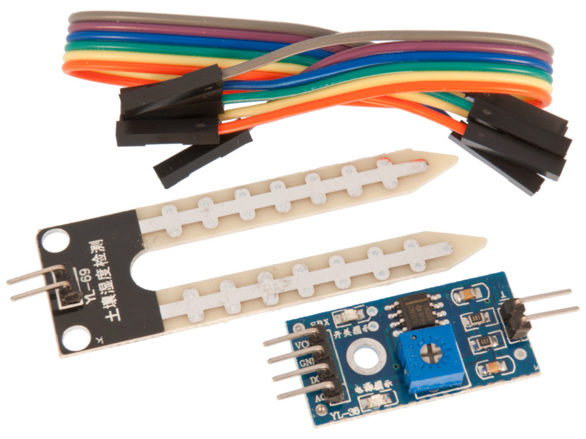
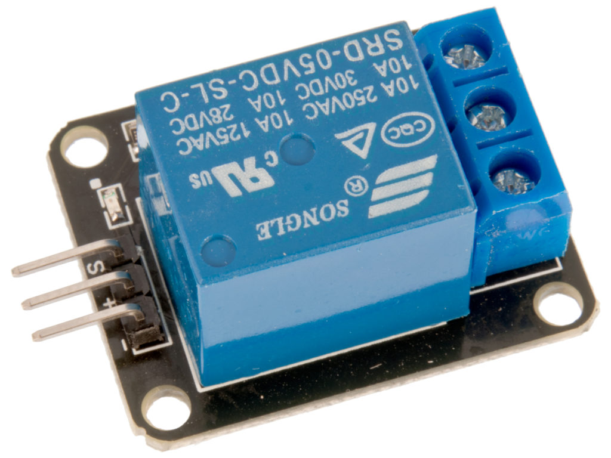
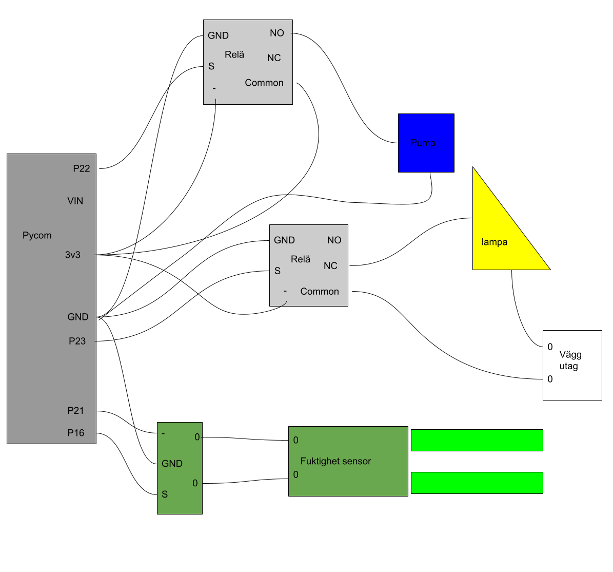

# Hardware

## Components with description of handling them

We have used a [Lopy4](https://docs.pycom.io/datasheets/development/lopy4/) and the [expansion board 3.1](https://docs.pycom.io/datasheets/expansionboards/expansion3/)

This is the [soil moisture sensor](https://www.electrokit.com/uploads/productfile/41015/41015738_-_Soil_Moisture_Sensor.pdf)
that we used.

These are the two [relays](https://www.electrokit.com/uploads/productfile/41015/41015704_-_5V_Relay_Module.pdf)
that we used. 

We used this [lamp](https://www.kjell.com/se/produkter/hem-fritid/tradgard/vaxtlampor/vaxtlampa-led-e27-1200-lm-p64560?gclid=Cj0KCQiAieWOBhCYARIsANcOw0zotIo42_MUFOpcMuNYAMZnTFBfwb3OmhILSr8SXYybIhZ_YeAcE9UaAkHfEALw_wcB&gclsrc=aw.ds)

## Connectivity chart

